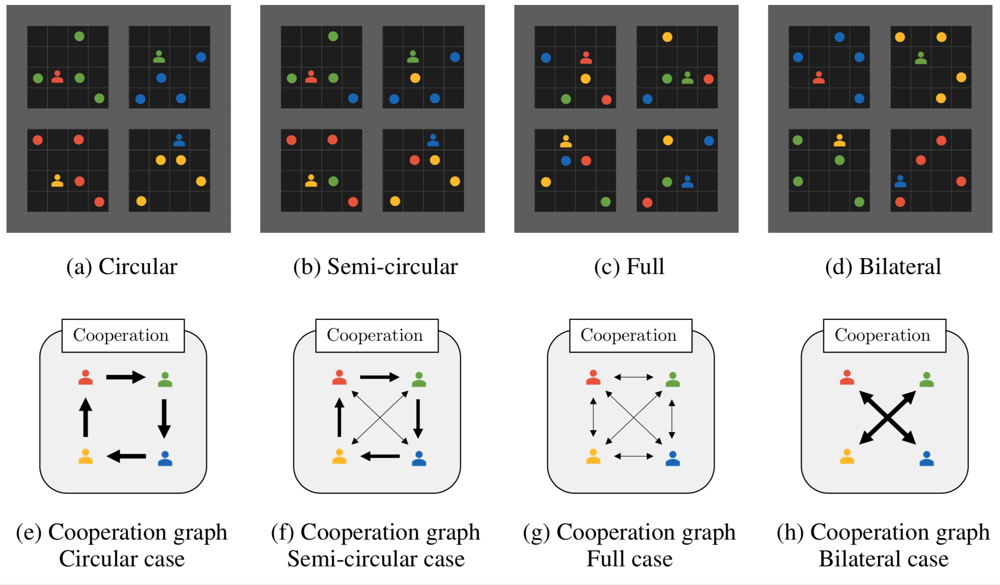

# Multi-Agent Circular Collect Game

A multi-agent circular social dilemma Gym game built on the [Multi-agent gridworld](https://github.com/ArnaudFickinger/gym-multigrid), based on the [MiniGrid environment](https://github.com/maximecb/gym-minigrid). 

## Installation

Requirements:


```
cd circular_collect
pip install -e .
```

## Test

```
python test.py
```

## Design

The environment is fully observable, to allow the observations of opponents behaviors.
The observation is encoded by a binary tensor of size [width, height, 8] i.e. each cell of the grid is encoded by a 8-tuple:
- the four first layers encode the position of agents
- the last four layers encode the presence of coins of different color

Five actions:
- Right
- Down
- Left
- Up
- Still

## Description of the game Circular Collect 

In the game N agents collect coins. They receive 
- +2 if a coin of their color is collected (by themselves or by another agent)
- -1 if they collect a coin of a color of another agent.


## Configure cooperation structure
One can adapt the maximal cooperation potential with the stochastic matrix of coins appearance: env.prob_matrix 

Here are some examples of cooperation structures:


